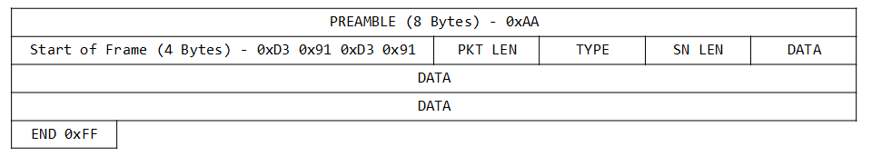
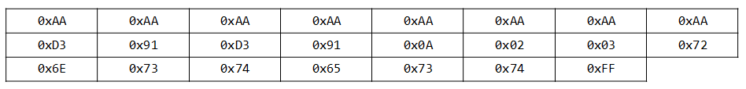
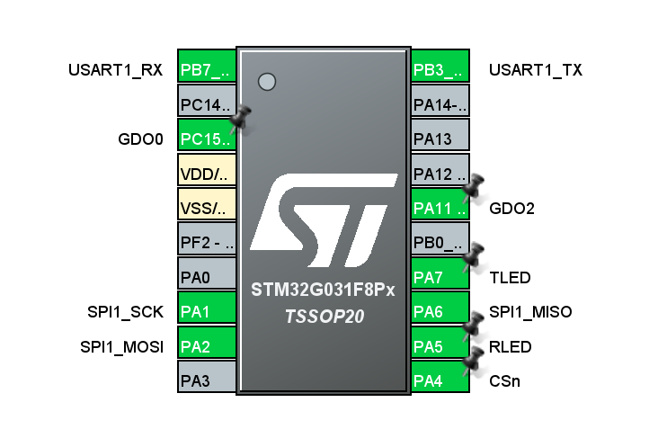
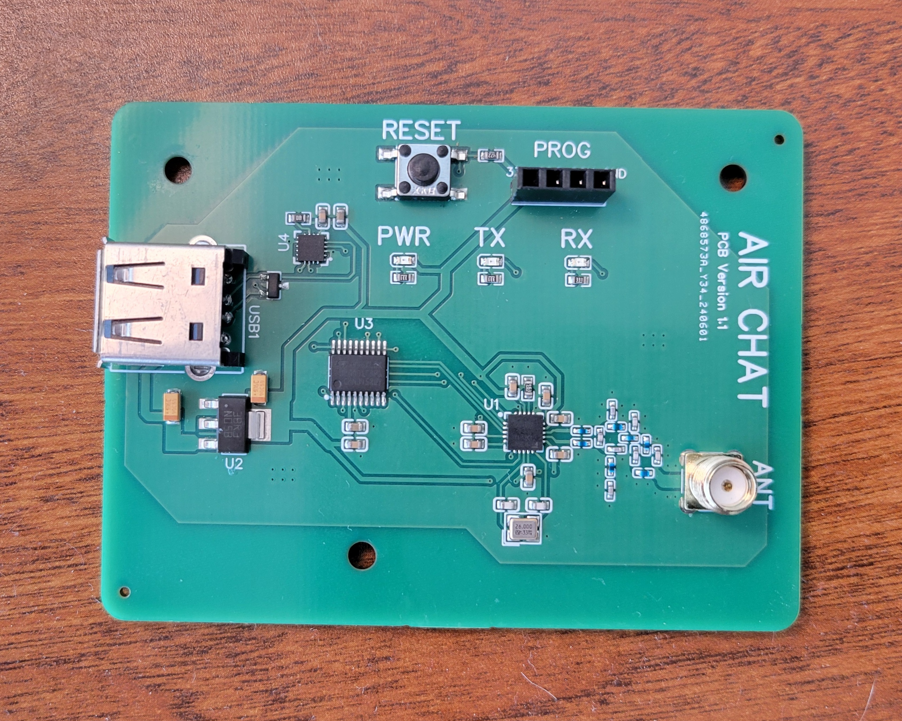
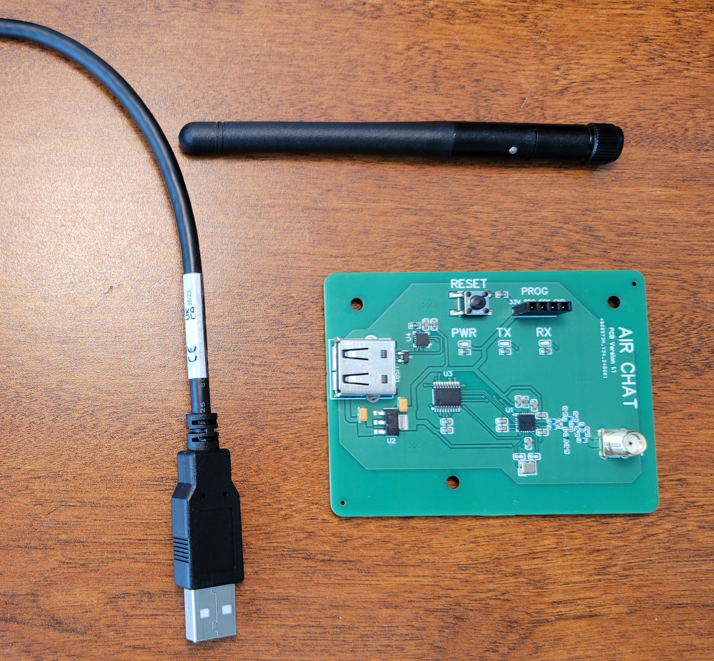
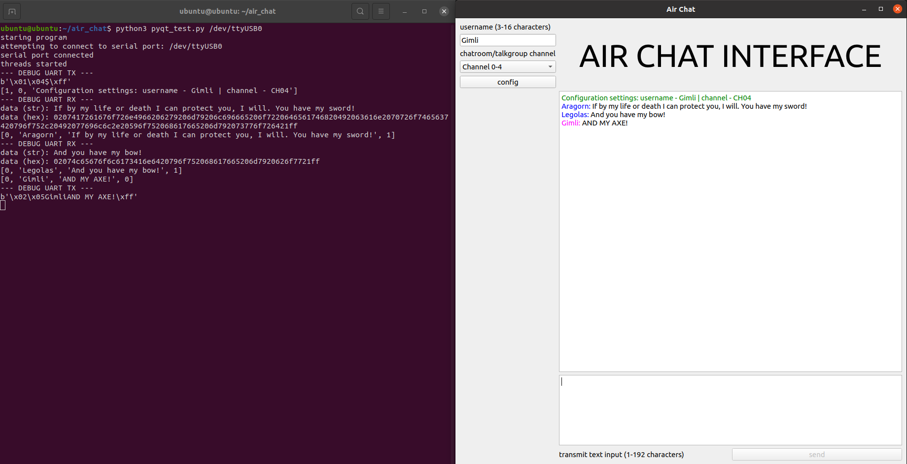

# AirChat

Author and original creator: Richard Shmel

AirChat is the project name for a low-cost, easily exploitable/reversible, RF transceiver. It is used as a capstone exercise for my Software Defined Radio 101 (SDR 101) course I am teaching at DEF CON Trainings.

##### TODO
Firmware is not optimized due to time constraints, and I would still call it a “beta” release. Refactor to use a more state-machine and interrupt-driven solution.

##### BUGS  
Carrier sense collision avoidance (CSCA) will fail to detect a transmission until the preamble is finished. OOK modulation has cross talk issue at close range (1-2 meters).

# Dependencies
Placeholder

# Overview

Project consists of 3 main components:
* custom PCB using a STM32 and a TI CC1101
* Firmware for the STM32 (C)
* Client software to interface with the board (Python)

System has two modulation types: 2FSK at 9600 baud and OOK at 4800 baud and is designed to transmit only ASCII characters as a simple “chat program”. Operates in the 915 ISM band with 16 separate channels, 8 for FSK and 8 for OOK. Interfacing with the chipset is done via UART and the USB-to-TTL chip on the PCB. Air Chat has no encryption, checksums, or nonces that would ensure data integrity or attribution; it is intentionally vulnerable as a learning tool for students.

# Transceiver Details

### RF Parameters
* 16 channels broken up into 8 2FSK and 8 OOK
* Each channel is spaced 200 kHz
* CH 00 starts at 913.05 MHz
* For 2FSK, the signal frequency deviation is 25 kHz
* Baud rate is 9600 for FSK and 4800 for OOK
* Power level is approximately 0 dBm at the antenna port

### Protocol
The protocol is the same for both 2FSK and OOK. Each packet is variable length up to 192 ASCII characters. 
The basic structure is shown in the figure below:

* Preamble: 8 bytes long, composed of alternating 1’s and 0’s (0xAA)
* Start of frame sequence: 4 bytes, 0xD3 0x91 repeated
* Packet length: 1 byte, integer packet length
* Type: 1 byte, integer packet type. RF messages will always be 0x02. Integers 0x00, 0x01, and 0x03 are reserved for internal control data.
* Screen name length: 1 byte, integer length of the user's chosen screen name
* Data: variable length, ASCII message data
* End of data sequence: 1 byte, always 0xFF

### Example TX

Username: “rns”
Message: “test”

Packet length:	0x0A (decimal 10)
[1 byte type, 1 byte SN length, 3 bytes screen name, 4 bytes data, and 1 byte end of data sequence]

Type: 0x02 (RF message)

SN Length: 0x03 (“r”, “n”, “s”,)

Data: ASCII values (“r”, “n”, “s”, “t”, “e”, “s”, “t”)

End: 0xFF

# Hardware

### Schematic 
PCB schematic can be found in the *hardware* folder. Key sections are:
* STM32-G03 microcontroller. Communicates with the client via USART 1 and with the RF chip via SPI 1. Has two LED outputs for TX and RX. Has two GPIO inputs from the RF chip which are used as signals to show specific information.
* Texas Instruments CC1101 RF Transceiver. Uses SPI to send/receive data from the STM32. Uses an SMA antenna to send/receive RF packets.
* LM1117 linear voltage regulator. Converts 5VDC from USB to 3.3VDC.
*CP2102 USB-to-TTL: Converts USB data to UART data. Original version omitted this and used a special cable. Newest hardware iteration adds this chip to the PCB.
* 915 MHz impedance matching network. PCB is configured to use the 915 ISM band. While the CC1101 can use other bands, the firmware for AirChat only allows 915 MHz.

  
*STM32 pin diagram from CubeMX.*

### PCB
PCB design was done in both KiCAD and EasyEDA. Production files (Gerber files, materials, and pick-and-place) are included in this repo. Top and bottom copper layers are located in the images folder. PCB measures 60mm by 80mm and has three M3-size screw mounting holes. Antenna attachment is SMA-F, so any 915 MHz SMA-M antenna will work. USB cable is a standard USB-A port.
  
*production version of the PCB*
  
*PCB next to antenna and USB cable.*

# Software
### Python client
Users interact with the AirChat PCB with a python client. The program is built using QTGui and gives the users an intuitive interface:
* Channel selection - channels 00 through 07 are FSK and channels 10 through 17 are OOK
* User-defined username from 3 to 16 characters
* User text input with a maximum message size of 192 characters
* Message display with color-codes
	* Red for error messages
	* Green for system messages
	* Blue for other user text messages
	* Magenta for self text messages

  
*AirChat GUI showing a simple text exchnage. Debug information is shown in the terminal.*
