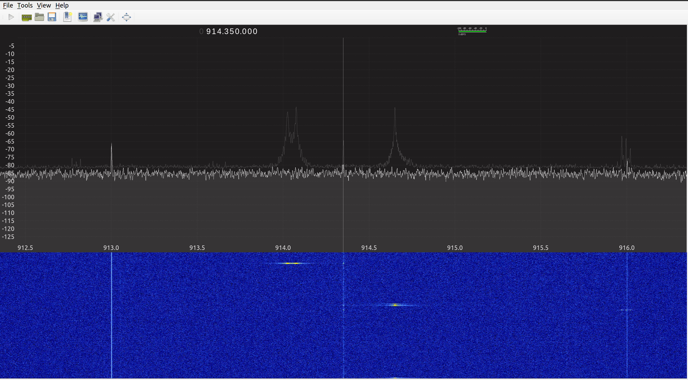
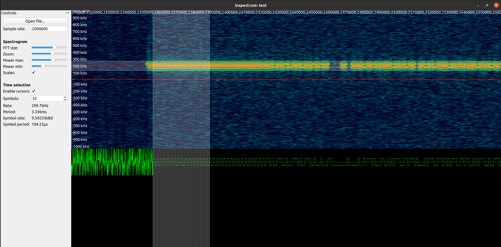
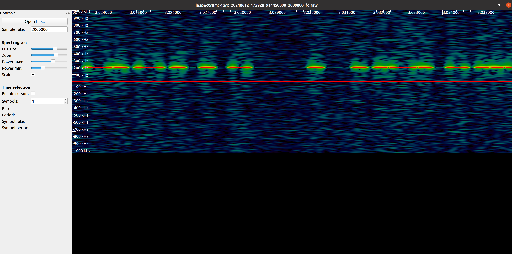
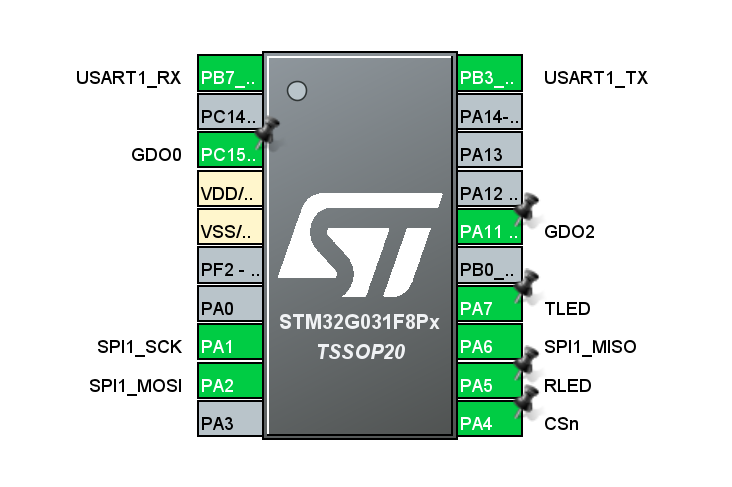
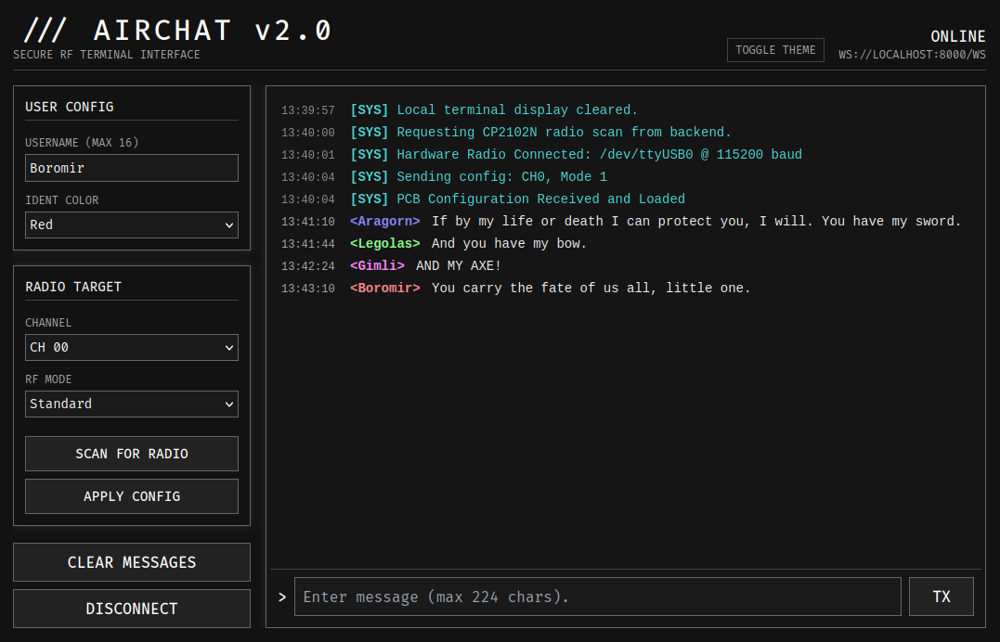

# AirChat

Author and original creator: Richard Shmel

AirChat is the project name for a low-cost, easily exploitable/reversible, RF transceiver. It is used as a capstone exercise for my Software Defined Radio 101 (SDR 101) course. For more information on that please visit https://www.rnstechsolutions.com 

# Dependencies and Installation

AirChat's host software is fully containerized using Docker. 

Ensure you have [Docker](https://docs.docker.com/engine/install/), [Docker Compose](https://docs.docker.com/compose/install/), and [Docker Buildx](https://docs.docker.com/build/install-buildx/) installed. The user running the container must be part of the `dialout` group to allow USB passthrough to the hardware.

```bash
sudo adduser USERNAME dialout
```
*(where USERNAME is the user to add to the group)*

To build the Docker image and run the orchestrator backend and web UI:

First, build the image using the provided shell script:
```bash
cd software/host/build
./build.sh
```

Then, start the container using Docker Compose:
```bash
cd ..
docker compose up -d
```
The Web UI will be available at `http://localhost:8000`.

# Overview

Project consists of 3 main components:
* Custom PCB using an STM32G03 and a TI CC1101
* Firmware for the STM32 (C, interrupt driven state machine)
* Host software (Python FastAPI backend and HTML/JS/Tailwind web UI)

System operates in the 915 ISM band and is designed to transmit ASCII characters as a simple terminal "chat program". AirChat has no encryption, checksums, or nonces that would ensure data integrity or attribution; it is intentionally vulnerable as a learning tool for students.

# Transceiver Details

### RF Parameters
* 10 Channels (CH 00 to CH 09) per mode.
* Three distinct RF Modes:
  * **Legacy:** OOK at 4800 baud
  * **Standard:** 2FSK at 9600 baud (25 kHz deviation)
  * **Advanced:** 4FSK at 38400 baud (25 kHz deviation)
* Power level is approximately +11 dBm at the antenna port for all modes.

  
*Spectrogram of both 2FSK and OOK.*

  
*2FSK TX capture.*

  
*OOK TX capture.*

### Protocol

The Over-The-Air (OTA) protocol uses variable-length packets. The underlying CC1101 handles the preamble (0xAA alternating), sync words (0xD3 0x91), and hardware packet length. The payload structure inside the RF FIFO is as follows:

| Byte Offset | Field | Size (Bytes) | Description |
|---|---|---|---|
| 0 | Type | 1 | Packet type ID (Always `0x02` for chat messages) |
| 1 | Color ID | 1 | Terminal UI color code (`0x01` to `0x08`) |
| 2 | SN Length | 1 | Length of Screen Name (`L`) |
| 3 | Screen Name | `L` | ASCII Username (Max 16 chars) |
| 3 + `L` | Message Data| Variable | ASCII Message (Max 224 chars) |

### Host-to-PCB Serial API

The host PC and the STM32 communicate over a 115200 baud serial connection using a simple binary protocol framed by UART IDLE line detection. 

| Direction | Type ID | Name | Payload Structure |
|---|---|---|---|
| Host -> PCB | `0x01` | Configuration | `[0x01] [Channel] [Mode] [Seed]` |
| Host <-> PCB| `0x02` | TX/RX Message | `[0x02] [Color ID] [SN Len] [Screen Name] [Message]` |
| PCB -> Host | `0x03` | System Status | `[0x03] [Status Code]` |

# Hardware

### Schematic 
PCB schematic can be found in the `hardware` folder. Key sections are:
* STM32-G03 microcontroller. Communicates with the host via USART 1 and with the RF chip via SPI 1. Uses DMA for high-speed UART transfers.
* Texas Instruments CC1101 RF Transceiver. Uses SPI to send/receive data. Uses an SMA antenna to send/receive RF packets.
* LM1117 linear voltage regulator. Converts 5VDC from USB to 3.3VDC.
* CP2102N USB-to-TTL: Converts USB data to UART data directly on the PCB.

  
*STM32 pin diagram from CubeMX.*

### PCB
PCB design was done in both KiCAD and EasyEDA. Production files (Gerber files, materials, and pick-and-place) are included in `hardware/production_files/`. PCB measures 60mm by 80mm and has three M3-size screw mounting holes. Antenna attachment is SMA-F.
  
*Production version of the PCB.*

# Software
### Web Client and Orchestrator
Users interact with the AirChat PCB using a browser-based terminal UI. The Python `orchestrator.py` uses FastAPI and WebSockets to bridge the serial hardware to the browser.
* Target configuration (Channel 00-09, Mode selection)
* Custom identifiers and terminal color coding
* Asynchronous hardware TX queueing with ACK verification

The backend code and Docker configuration are located in `software/host/`.

  
*AirChat web GUI terminal interface.*

### Firmware
Firmware is written for the STM32 using the Cube IDE and is located in `software/firmware/`. 
The updated architecture relies on an interrupt-driven state machine:
* **UART DMA:** Uses IDLE line detection to capture variable-length serial packets directly into a ring buffer.
* **Timer Interrupts:** Replaces blocking delays by polling the CC1101 RX FIFO asynchronously.
* **Dynamic Loading:** The `CC1101_Transmit_Packet` function handles payloads larger than the CC1101's 64-byte FIFO by dynamically feeding the FIFO mid-transmission.

# License
This project is licensed under the **Creative Commons: Attribution-NonCommercial 4.0 International (CC BY-NC 4.0)**. 

It is open source and free for anyone to use, share, and adapt. However, you may **only use this material for non-commercial purposes** unless explicitly authorized by the creator. Contact form available at https://www.rnstechsolutions.com
